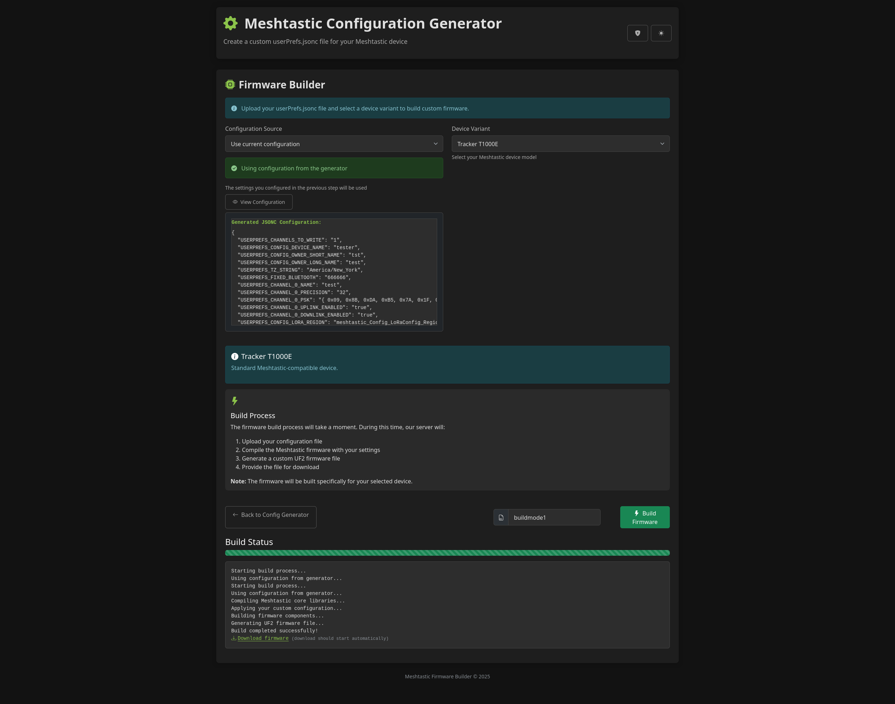

# Meshtastic Configuration Generator

[](https://www.python.org/downloads/)
[](https://flask.palletsprojects.com/)
[](https://opensource.org/licenses/MIT)
[](http://makeapullrequest.com)



A modern, user-friendly web interface for generating Meshtastic device configurations and building custom firmware. This tool streamlines the process of creating `userPrefs.jsonc` files and compiling them directly into UF2 firmware images to apply to meshtastic devices in DFU mode.

## 📚 Table of Contents

- [🚀 Features](#-features)
  - [Configuration Generator](#configuration-generator)
  - [Firmware Builder](#firmware-builder)
  - [Administration](#administration)
- [📋 Requirements](#-requirements)
- [🛠️ Installation](#️-installation)
  - [Quick Start](#quick-start)
  - [Admin Configuration](#admin-configuration)
  - [Docker Installation](#docker-installation)
- [🎯 Usage](#-usage)
  - [Generating Configuration Files](#generating-configuration-files)
  - [Building Custom Firmware](#building-custom-firmware)
  - [Admin Functions](#admin-functions)
  - [Flashing Firmware](#flashing-firmware)
- [🏗️ Architecture](#️-architecture)
- [🧪 Development](#-development)
- [🐛 Troubleshooting](#-troubleshooting)
- [🤝 Contributing](#-contributing)
- [📄 License](#-license)
- [🙏 Acknowledgments](#-acknowledgments)
- [📊 Project Status](#-project-status)
- [🔗 Related Projects](#-related-projects)

## 🚀 Features

### Configuration Generator
- **Intuitive Web Interface**: Clean, modern UI with Bootstrap styling and dark mode support
- **Complete Configuration Options**: 
  - Device information (name, owner details, timezone)
  - Multi-channel configuration with custom PSK generation
  - LoRa radio settings (region, modem preset, channel selection)
  - GPS configuration with smart positioning
  - Network settings (WiFi, MQTT)
  - Advanced device settings
- **Real-time Preview**: See your configuration in JSONC format before generating
- **Secure PSK Generation**: Cryptographically secure pre-shared key generation
- **Timezone Auto-detection**: Automatically detects and sets your local timezone

### Firmware Builder
- **Direct Firmware Compilation**: Build custom firmware with your configuration baked in
- **40+ Device Variants Supported**: Including T-Beam, Heltec, RAK, and many more
- **Custom Firmware Naming**: Option to provide custom filenames for your builds
- **Optimized Build Process**: Multi-threaded compilation for faster builds
- **Progress Tracking**: Real-time build status and error reporting

### Administration
- **Firmware Management**: Built-in firmware update system
- **System Monitoring**: View firmware versions and system status
- **Build Management**: Admin dashboard for managing builds and system maintenance

## 📋 Requirements

- Python 3.8 or higher
- PlatformIO (for firmware building - installed automatically)
- Git (for firmware updates)
- 4GB+ RAM (recommended for firmware compilation)
- 10GB+ disk space (for firmware source and builds)

## 🛠️ Installation

### Quick Start

1. **Clone the repository**
   ```bash
   git clone https://github.com/Crank-Git/MTFWBuilder.git
   cd MTFWBuilder
   ```

2. **Create virtual environment**
   ```bash
   python -m venv venv
   source venv/bin/activate  # On Windows: venv\Scripts\activate
   ```

3. **Install dependencies**
   ```bash
   pip install -r requirements.txt
   ```

4. **Run the application**
   ```bash
   python app.py
   ```

5. **Open your browser** and navigate to `http://localhost:5000`

### Admin Configuration

For admin functions (firmware updates, cleanup), create a `config.json` file:

```bash
# Copy the example config
cp config.json.example config.json

# Edit with your secure admin password
nano config.json
```

Example `config.json`:
```json
{
  "admin_password": "your_secure_admin_password_here"
}
```

**Note**: If no `config.json` exists, the default password `meshtastic` will be used.

### Docker Installation

For the easiest deployment experience, use Docker:

**Prerequisites:**
- Docker and Docker Compose installed
- 4GB+ RAM available for the container
- 10GB+ disk space for firmware builds

**Quick Start:**
```bash
# Clone the repository
git clone https://github.com/Crank-Git/MTFWBuilder.git
cd MTFWBuilder

# Start with Docker Compose
docker compose up -d

# Or use the deployment script
./docker-deploy.sh start
```

**Using the Deployment Script:**
```bash
# Build the image
./docker-deploy.sh build

# Start the container
./docker-deploy.sh start

# View logs
./docker-deploy.sh logs

# Stop the container
./docker-deploy.sh stop

# Update and rebuild
./docker-deploy.sh update

# Clean up old build files
./docker-deploy.sh cleanup

# View all available commands
./docker-deploy.sh help
```

**Manual Docker Commands:**
```bash
# Build the image
docker build -t mtfwbuilder .

# Run the container
docker run -d \
  --name mtfwbuilder \
  -p 5000:5000 \
  -v mtfwbuilder_firmware:/app/firmware \
  -v mtfwbuilder_builds:/app/.pio \
  mtfwbuilder

# View logs
docker logs -f mtfwbuilder
```

**Environment Configuration:**
```bash
# Copy the example environment file
cp docker.env.example .env

# Edit configuration (optional)
nano .env

# Copy the admin config example
cp config.json.example config.json

# Edit admin password (recommended)
nano config.json
```

The application will be available at `http://localhost:5000`

## 🎯 Usage

#### REMEMBER TO DOWNLOAD THE FIRMWARE ON THE ADMIN PAGE UTILIZING YOUR ADMIN PASSWORD IN CONFIG.JSON

### Generating Configuration Files

1. **Basic Information**: Enter your device name, owner information, and timezone
2. **Channel Configuration**: Set up your mesh channels with custom names and encryption
3. **LoRa Settings**: Configure your radio parameters for your region
4. **GPS Configuration**: Set up position reporting and smart positioning
5. **Network Settings**: Configure WiFi and MQTT if needed
6. **Preview & Download**: Review your configuration and download the `userPrefs.jsonc` file

### Building Custom Firmware

1. **Generate Configuration**: Create your configuration using the generator above
2. **Select Device**: Choose your specific Meshtastic device variant
3. **Build Firmware**: Click "Build Firmware" and wait for compilation
4. **Download**: Get your custom firmware file ready to flash

### Admin Functions

Access the admin panel at `http://localhost:5000/admin` for system management:

1. **Firmware Updates**: Download and update the Meshtastic firmware source code
   - Click "Update Firmware" to get the latest firmware from GitHub
   - Required before building firmware for the first time
   - Updates include new device support and bug fixes

2. **System Cleanup**: Manually clean up old build files to free disk space
   - View current system status and firmware version
   - Trigger manual cleanup of temporary build directories

**Note**: Admin functions require the admin password configured in `config.json`

### Flashing Firmware

The generated firmware is in UF2 format for easy flashing:

1. **Put your device in DFU mode** (usually by double-pressing the reset button)
2. **Drag and drop** the `.uf2` file to the device when it appears as a USB drive
3. **Device will reboot** automatically with your custom configuration

NOTE: You may need to download the `nrf_erase_sd7_3.uf2` from the webflasher below and erase your device before reflashing.

Alternatively, use the [Meshtastic Web Flasher](https://flasher.meshtastic.org/) for a guided flashing experience.

## 🏗️ Architecture

```
MTFWBuilder/
├── app.py                 # Main Flask application
├── requirements.txt       # Python dependencies
├── static/               # CSS, JavaScript, and assets
│   ├── css/             # Stylesheets
│   └── js/              # JavaScript modules
├── templates/           # Jinja2 HTML templates
│   └── includes/        # Reusable template components
├── utils/               # Utility modules
│   ├── jsonc_generator.py    # Configuration file generator
│   └── firmware_updater.py   # Firmware management
└── firmware/            # Meshtastic firmware source (auto-downloaded)
```

## 🧪 Development

### Setting Up Development Environment

1. Fork the repository
2. Create a feature branch: `git checkout -b feature-name`
3. Make your changes
4. Submit a pull request

## 🐛 Troubleshooting

### Common Issues

**Build Fails with "PlatformIO not found"**
- PlatformIO is installed automatically with the requirements
- If issues persist, try: `pip install platformio`

**Firmware download fails**
- Check disk space (builds require ~2GB temporarily)
- Ensure PlatformIO dependencies are installed
- Try a different device variant

**Configuration not applying**
- Verify JSON syntax in preview
- Check that all required fields are filled
- Ensure PSK format is correct (32-byte hex array)

**Device not recognized for flashing**
- Make sure device is in DFU/bootloader mode
- Try a different USB cable or port
- Check device-specific flashing instructions

**Disk space issues**
- Build files are automatically cleaned up after download (5 second delay)
- Old build directories are removed after 1 hour automatically
- Periodic cleanup runs every 30 minutes
- Manual cleanup: `./docker-deploy.sh cleanup` or use admin panel
- Check volume usage: `docker volume ls`

**Security: userPrefs cleanup**
- userPrefs.jsonc files contain sensitive PSK (encryption keys)
- Automatically removed after successful firmware build
- Cleaned up on build errors and during periodic maintenance
- Manual cleanup removes any leftover userPrefs files
- Files are never left on disk longer than necessary

**Security: UF2 firmware cleanup**
- UF2 firmware files contain compiled PSK data from userPrefs
- Original UF2 files are automatically deleted after copying to secure build directory
- Prevents PSK leakage between different user builds
- All variant UF2 files cleaned up during maintenance
- Ensures no sensitive data persists in PlatformIO build cache

**Admin functions not working**
- Check that `config.json` exists with your admin password
- Default password is `meshtastic` if no config file exists
- Admin functions: firmware updates, manual cleanup
- Test with: `curl -X POST -d "admin_key=your_password" http://localhost:5000/cleanup`

### Getting Help

1. Check the [Issues](https://github.com/Crank-Git/MTFWBuilder/issues) page
2. Review [Meshtastic Documentation](https://meshtastic.org/docs/)
3. Join the [Meshtastic Discord](https://discord.gg/ktMAKGBnBs)

## 🤝 Contributing

We welcome contributions! Here's how you can help:

### Types of Contributions

- 🐛 **Bug Reports**: Help us identify and fix issues
- 💡 **Feature Requests**: Suggest new functionality
- 📖 **Documentation**: Improve our docs and examples
- 🔧 **Code Contributions**: Submit bug fixes and new features
- 🎨 **UI/UX Improvements**: Make the interface even better

### Quick Contribution Guide

1. Fork the project
2. Create your feature branch (`git checkout -b feature/AmazingFeature`)
3. Commit your changes (`git commit -m 'Add some AmazingFeature'`)
4. Push to the branch (`git push origin feature/AmazingFeature`)
5. Open a Pull Request

### Development Setup

1. **Fork and clone** the repository
2. **Create a virtual environment**: `python -m venv venv`
3. **Activate it**: `source venv/bin/activate` (Linux/Mac) or `venv\Scripts\activate` (Windows)
4. **Install dependencies**: `pip install -r requirements.txt`
5. **Make your changes** and test thoroughly
6. **Submit a pull request** with a clear description

## 📄 License

**MIT License**

Copyright (c) 2025 Meshtastic Configuration Generator Contributors

Permission is hereby granted, free of charge, to any person obtaining a copy
of this software and associated documentation files (the "Software"), to deal
in the Software without restriction, including without limitation the rights
to use, copy, modify, merge, publish, distribute, sublicense, and/or sell
copies of the Software, and to permit persons to whom the Software is
furnished to do so, subject to the following conditions:

The above copyright notice and this permission notice shall be included in all
copies or substantial portions of the Software.

THE SOFTWARE IS PROVIDED "AS IS", WITHOUT WARRANTY OF ANY KIND, EXPRESS OR
IMPLIED, INCLUDING BUT NOT LIMITED TO THE WARRANTIES OF MERCHANTABILITY,
FITNESS FOR A PARTICULAR PURPOSE AND NONINFRINGEMENT. IN NO EVENT SHALL THE
AUTHORS OR COPYRIGHT HOLDERS BE LIABLE FOR ANY CLAIM, DAMAGES OR OTHER
LIABILITY, WHETHER IN AN ACTION OF CONTRACT, TORT OR OTHERWISE, ARISING FROM,
OUT OF OR IN CONNECTION WITH THE SOFTWARE OR THE USE OR OTHER DEALINGS IN THE
SOFTWARE.

## 🙏 Acknowledgments

- [Meshtastic Project](https://meshtastic.org/) for the amazing mesh networking platform
- [Bootstrap](https://getbootstrap.com/) for the beautiful UI components
- [PlatformIO](https://platformio.org/) for the firmware build system
- All contributors who help make this project better

## 📊 Project Status

- ✅ Configuration Generation
- ✅ Firmware Building  
- ✅ Multi-device Support
- ✅ Web Interface
- ✅ Docker Support

## 🔗 Related Projects

- [Meshtastic](https://github.com/meshtastic/Meshtastic-device) - The main Meshtastic firmware
- [Meshtastic Web](https://github.com/meshtastic/web) - Official web interface
- [Meshtastic Python](https://github.com/meshtastic/Meshtastic-python) - Python API

---

**Star ⭐ this repo if you find it useful!**