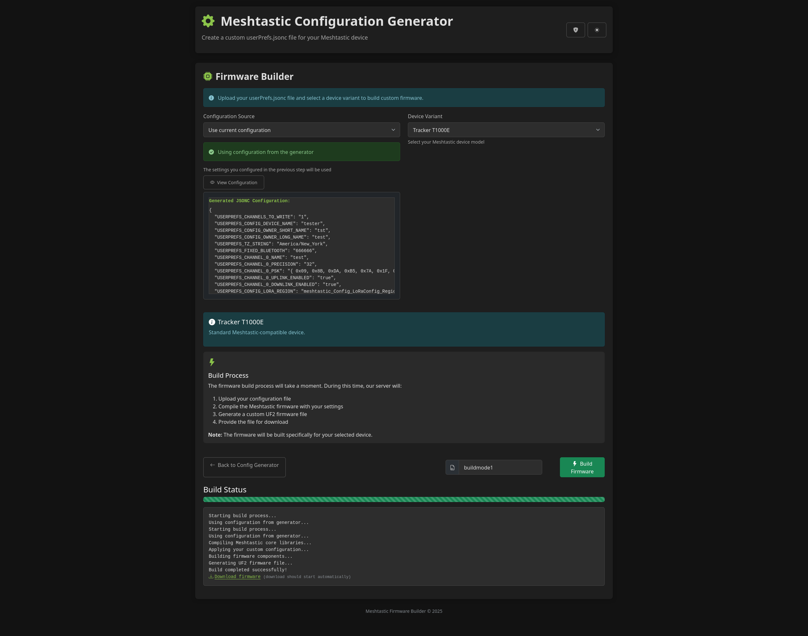

# MTFWBuilder

A self-hosted web application for generating Meshtastic device configurations and building custom firmware. Configure your device, bake settings into firmware, and download ready-to-flash binaries — all from one interface.



## What It Does

**MTFWBuilder is the only tool in the Meshtastic ecosystem that combines configuration generation with firmware compilation in a self-hosted package.**

- The official [Web Flasher](https://flasher.meshtastic.org/) flashes pre-built firmware
- The [Python CLI](https://github.com/meshtastic/Meshtastic-python) configures devices after flashing
- **MTFWBuilder bakes your config INTO the firmware before flashing**

### Features

- **Configuration Generator** — Web UI for building `userPrefs.jsonc` files with channel setup, LoRa settings, GPS, WiFi/MQTT, and more
- **Firmware Builder** — Compiles custom firmware via PlatformIO with your config pre-loaded
- **62 Device Variants** — ESP32 (.bin), nRF52 (.uf2), and RP2040 (.uf2) with automatic format detection
- **Factory Binary Support** — ESP32 devices get both `firmware.bin` and `firmware.factory.bin`
- **Real-Time Build Progress** — SSE-powered status updates during compilation
- **Admin Dashboard** — Firmware source management, system status, build cleanup
- **Dark Mode** — Default dark theme with light mode toggle

## Quick Start

### Docker (recommended)

```bash
git clone https://github.com/Crank-Git/MTFWBuilder.git
cd MTFWBuilder
docker compose up -d
```

Open `http://localhost:5000`

### Manual

```bash
git clone https://github.com/Crank-Git/MTFWBuilder.git
cd MTFWBuilder
python -m venv venv
source venv/bin/activate
pip install -e .
uvicorn mtfwbuilder.main:app --host 0.0.0.0 --port 5000
```

### Configuration

```bash
cp config.yaml.example config.yaml
# Edit config.yaml — set admin_password and secret_key
```

If no `config.yaml` exists, the app auto-migrates from `config.json` (v1 format) or uses defaults. Plaintext passwords are auto-hashed to bcrypt on first startup.

## Usage

### 1. Generate Configuration

1. Fill in device name, owner info, timezone
2. Configure channels with encryption (PSK auto-generated)
3. Set LoRa region and modem preset
4. Configure GPS, WiFi, MQTT as needed
5. Preview and download `userPrefs.jsonc`

### 2. Build Firmware

1. Upload your `userPrefs.jsonc` or use the config you just generated
2. Select your device variant from the dropdown
3. Click **Build Firmware** — watch real-time progress
4. Download your custom firmware file

### 3. Flash Your Device

**ESP32 (.bin)** — Use the factory binary for best results:
```bash
esptool.py --chip esp32 --port /dev/ttyUSB0 --baud 921600 write_flash 0x0 firmware.factory.bin
```

**nRF52/RP2040 (.uf2)** — Put device in DFU mode, drag and drop the `.uf2` file.

### 4. Admin Panel

Access `/admin` to update firmware source from GitHub and manage builds. Requires the admin password set in `config.yaml`.

## Architecture

```
MTFWBuilder/
├── mtfwbuilder/                    # FastAPI application
│   ├── main.py                     # App factory, lifespan, middleware
│   ├── config.py                   # Settings (pydantic-settings, env vars)
│   ├── auth.py                     # Bcrypt + signed cookie sessions
│   ├── database.py                 # SQLite (build history, config profiles)
│   ├── models.py                   # Pydantic request/response validation
│   ├── rate_limit.py               # slowapi rate limiting
│   ├── routers/
│   │   ├── config_generator.py     # /api/v1/generate, preview, download
│   │   ├── firmware_builder.py     # /api/v1/build-firmware, SSE progress
│   │   ├── admin.py                # Login, firmware updates, cleanup
│   │   └── pages.py                # HTML page routes
│   └── services/
│       ├── jsonc_generator.py      # userPrefs.jsonc generation
│       ├── build_service.py        # Async PlatformIO build pipeline
│       ├── device_registry.py      # YAML device variant registry
│       ├── firmware_updater.py     # GitHub firmware source downloads
│       └── cleanup_service.py      # Build artifact and PSK cleanup
├── devices/variants.yaml           # 62 device variants (single source of truth)
├── templates/                      # Jinja2 + htmx templates
├── static/                         # CSS, JS
├── tests/                          # 106 pytest tests
└── pyproject.toml                  # Modern Python packaging
```

### Tech Stack

| Component | Technology | Why |
|-----------|-----------|-----|
| Backend | FastAPI + uvicorn | Async builds, WebSocket-ready, auto OpenAPI docs |
| Frontend | Jinja2 + htmx + Bootstrap 5 | Dynamic UI without a JS build pipeline |
| Build Progress | Server-Sent Events (SSE) | One-way progress, proxy-friendly, htmx-native |
| Database | SQLite (aiosqlite) | Zero-config, build history and config profiles |
| Auth | bcrypt + itsdangerous | Hashed passwords, signed cookie sessions |
| Device Registry | YAML | Human-readable, git-diffable, easy to contribute |
| Build System | PlatformIO | Industry standard for embedded firmware |
| Packaging | pyproject.toml + hatchling | Modern Python, `pip install` ready |

### API

Auto-generated OpenAPI documentation at `/docs` when the app is running.

Key endpoints:
- `POST /api/v1/generate` — Generate config from JSON
- `POST /api/v1/preview` — Preview config without downloading
- `POST /api/v1/download` — Download `userPrefs.jsonc`
- `POST /api/v1/build-firmware` — Start firmware build
- `GET /api/v1/build-progress/{id}` — SSE build progress stream
- `GET /api/v1/download-firmware/{id}` — Download built firmware
- `GET /api/v1/system-info` — Firmware version and status

## Docker

### Development

```bash
docker compose up -d
docker compose logs -f
```

### Production

```bash
# Copy and edit config
cp config.yaml.example config.yaml

# Run with nginx reverse proxy
docker compose -f docker-compose.yml -f docker-compose.prod.yml up -d
```

### Volumes

| Volume | Purpose |
|--------|---------|
| `firmware_data` | Downloaded firmware source |
| `build_cache` | PlatformIO build cache |
| `platformio_cache` | PlatformIO toolchains (~200MB per architecture) |
| `temp_data` | Temporary build directories |
| `logs` | Application logs |

## Security

- Admin passwords stored as **bcrypt hashes** (auto-migrated from plaintext)
- Session cookies: **httpOnly, SameSite=Lax, Secure** (in production)
- PSK encryption keys **scrubbed** from build artifacts after compilation
- Build directories **isolated** per build, cleaned after download
- All subprocess calls use **parameterized arguments** (no `shell=True`)
- **Rate limiting** on login (10/min) and build (5/min) endpoints
- File uploads **validated** (64KB max, UTF-8, JSON content)
- **Path traversal protection** on firmware download endpoint

## Development

```bash
# Install with dev dependencies
pip install -e ".[dev]"

# Run tests
pytest

# Run with coverage
pytest --cov=mtfwbuilder

# Format
black mtfwbuilder/ tests/

# Lint
ruff check mtfwbuilder/ tests/

# Dev server with hot reload
uvicorn mtfwbuilder.main:app --reload --port 5000
```

See [CONTRIBUTING.md](CONTRIBUTING.md) for detailed contribution guidelines.

## Troubleshooting

**Build fails with "Firmware source not installed"**
- Go to `/admin` and click Update Firmware to download the source from GitHub

**Configuration not taking effect (ESP32)**
- Always use `firmware.factory.bin` — it includes bootloader and partition table
- Try a full erase first: `esptool.py --chip esp32 erase_flash`

**Build times out after 15 minutes**
- First build for each architecture downloads the toolchain (~200MB)
- Subsequent builds use cached toolchains and are much faster
- Docker: ensure `platformio_cache` volume is mounted

**Docker disk space issues**
- Build files auto-clean after download and after 1 hour
- Manual cleanup: use the Admin panel or `docker compose exec mtfwbuilder python -c "from mtfwbuilder.services.cleanup_service import *; ..."`

## License

MIT License. See [LICENSE](LICENSE) in the repository.

## Acknowledgments

- [Meshtastic](https://meshtastic.org/) — The mesh networking platform
- [PlatformIO](https://platformio.org/) — Firmware build system
- [FastAPI](https://fastapi.tiangolo.com/) — Modern Python web framework
- [htmx](https://htmx.org/) — Dynamic HTML without JavaScript frameworks
- [Bootstrap](https://getbootstrap.com/) — UI components

## Related Projects

- [Meshtastic Firmware](https://github.com/meshtastic/firmware) — Official firmware
- [Meshtastic Web Flasher](https://flasher.meshtastic.org/) — Official web flasher
- [Meshtastic Python](https://github.com/meshtastic/Meshtastic-python) — Python API
